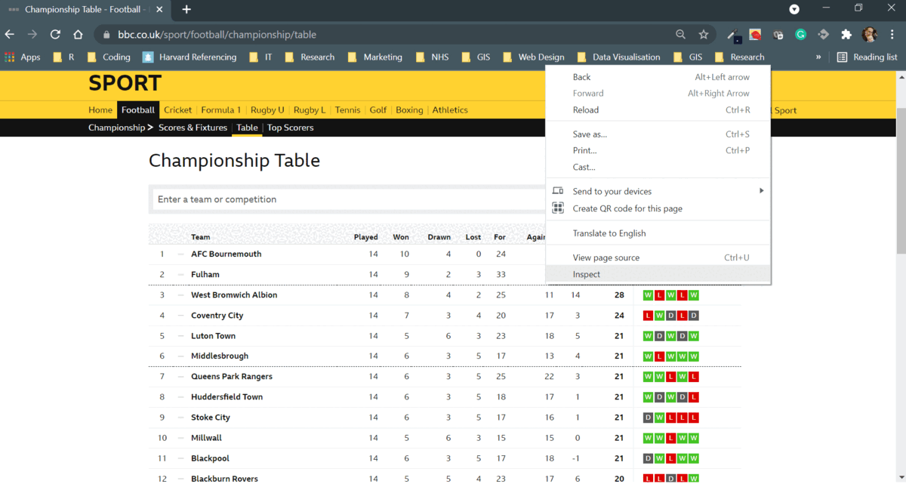

``` {r setup, include=FALSE}
library(tidyverse)
library(NHSDataDictionaRy)
#devtools::install_github("gadenbuie/xaringanExtra")
library(xaringanExtra)
library(ggplot2)
library(plotly)

```


## Introduction
Welcome to the NHSDataDictionaRy workshop. Today we will learn how to work with the data dictionary for NHS lookup tasks, as well as how to extend the package to work with any website. The concentration of the workshop will be broken down as such:

- Getting familiar with the NHSDataDictionaRy package and all the underlying functions
- Understanding the [nhs_data_elements()]() elements function and how to filter on this
- Gather text from any website and perform some text cleaning operations on the text, using a combination of functions contained in the package
- Using the [TableR](https://rdrr.io/cran/NHSDataDictionaRy/man/tableR.html) function to retrieve HTML tables from the data dictionary site and then extending this to other websites
- Working with XPath website elements with the NHSDataDictionaRy package
- How to use the package and retrieve website elements
- In general, a whistle stop tour of web scraping and how to do this with ease with the package

---
## Watch our previous webinar on how to use this package
This was taken from a webinar we recorded a how to guide from the launch of the NHSDataDictionaRy package. This may be useful for referring to, but most of what is covered in the video will be in today's workshop. 
<br></br>


<iframe width="600" height="400" src="https://www.youtube.com/embed/MqCFHCbTORs" align="left" title="NHSDataDictionaRy tutorial" frameborder="0" allow="accelerometer; autoplay; clipboard-write; encrypted-media; gyroscope; picture-in-picture" allowfullscreen></iframe>


---
class: inverse, middle, left, hide-logo
# Loading libraries

---
# Loading libraries in NHSDataDictionaRy package

To load the libraries needed for this session you will need to bring in the following:

```{r comment='#'}
library(NHSDataDictionaRy)
```

This will bring in the libraries needed to work with the package. The next step would be to check the dependencies in the package: 

```{r avail_packs}
packrat:::recursivePackageDependencies("NHSDataDictionaRy", lib.loc = .libPaths())
```

---
class: inverse, middle, left, hide-logo
# Working with the TableR, nhs_data_elements and nhs_tableR functions

---
# Starting with the nhs_data_elements() function

To retrieve the list of currrent NHS lookups in the table finder we use the underlying function:

```{r table_finder}

nhs_data_table <- nhs_data_elements()
```

This function will then return the full list of data elements the package has scraped from the [NHS Data Dictionary website](https://www.datadictionary.nhs.uk/). 

An example of what has been scraped is on the next slide.

---

# Working with the scraped values

These scraped values will allow us to access the XPath elements of the website directly (don't worry if you don't know what an XPath is, we will get to that later on). To pull down a lookup table using the nhs_data_elements master reference we can use the TableR function to achieve this:

## Getting the Activity Treatment Function Codes

```{r table_r_working_with_table}

# Filter the table
act_treatment_function <- nhs_data_table %>% 
  dplyr::filter(link_name == "ACTIVITY TREATMENT FUNCTION CODE") 
```

On the next slide you will see this has returned the lookup that I require:

---

```{r lookup}
# Use the TableR function to pull back the data table
act_treat_lookup <- NHSDataDictionaRy::tableR(url=act_treatment_function$full_url,
                          xpath=act_treatment_function$xpath_nat_code,
                          title="NHS Hospital Activity Treatment Function Code")

print(head(act_treat_lookup,5))

```
This lookup will return the lookup table needed.
---
## What if the element is not returned?

I include an example of when an element is not returned, as not all elements from the list have corresponding HTML data tables to extract. A worked example is below:

```{r table_r_working_with_table_error}

# Filter the table
abb_ment_test_score <- nhs_data_table %>% 
  dplyr::filter(link_name == "ABBREVIATED MENTAL TEST SCORE") 

# This will show a NULL return, as there is no HTML table present
null_output <- NHSDataDictionaRy::tableR(abb_ment_test_score$full_url,
                          abb_ment_test_score$xpath_nat_code)


```
This shows a ***NULL*** return, as there is no HTML present for the national code specified. This can be highlighted by using the NHS Data Dictionary website to highlight this.

---
## Checking the NHS Data Dictionary website

.pull-left[

]

.pull-right[
You can see that the website contains no national code table, thus the message.

You will not be able to retrieve these elements from the site, so the package presents you with a warning that these HTML table tables do not exist. 

This is supposed to be informative and will allow you then to quickly inspect other items of interest.

]

---
background-image: url(man/figures/practice.jpg)


---
## Introducing a quicker way to retrieve elements

Until now we have been working long hand and finding with retrieving the list of lookups and then using the TableR function. There is a more simple function in the package to use to do this, but I wanted to get you familiar with using the returned elements such as the URL and XPath, because we will come on to this again later.

### nhs_table_findeR to the rescue

```{r quicker_way_to_ret_elements}
tfc <- NHSDataDictionaRy::nhs_table_findeR("ACTIVITY TREATMENT FUNCTION CODE",
                                           title="Treatment Function Code")

glimpse(tfc)

```

This function replaces the convoluted code we used earlier. 

---
## Using the lookup to join on to hospital data
We have this lookup and now we will generate some hospital data to match with our lookups:
```{r generated_data}

spec_code <- rep(as.character(c(101,102,103,104,105,106,107, 108)), 12)
attends <- round(rnorm(length(spec_code), 500, 50))
breaches <- round(rnorm(length(spec_code), 40, 3))
admits <- round(rnorm(length(spec_code), 300, 20))
month <- rep(c("Jan", "Feb", "March", "April", "May", "Jun", "July", "Aug", "Sept",
               "Oct", "Nov", "Dec"),8)
# Combine these atomic vectors into tibble
ed_act_by_month <- tibble(spec_code, attends, breaches, admits, month)
glimpse(ed_act_by_month)
                          
```


---
## Using our custom data to join our lookups

Now we have some data to match, we can join our dynamic lookup from the web on to the lookup:

```{r join_on activity_data}
# Get our tfc and we are going to join this to specialty code
joined_activity = ed_act_by_month %>% 
  dplyr::left_join(tfc, by = c("spec_code"="Code")) %>% 
  dplyr::select(everything(), -c(Dict_Type, DttmExtracted))

glimpse(joined_activity)


```


---
background-image: url(man/figures/practice.jpg)
# Practice time - 10 minutes
Try joining the main specialty code to this data

---
## Practice solution
This is pretty simple really - I just need to use the nhs_table_findeR function to get my lookup, if you are not sure what the string is to pass, use the nhs_data_elements() function to get all the strings. 

```{r practice_solution_two}
main_spec <- NHSDataDictionaRy::nhs_table_findeR("CARE PROFESSIONAL MAIN SPECIALTY CODE",
                                    title="Main Specialty")

# Join our main specialty on to the ed_act_by_month tibble
main_spec_with_act <- ed_act_by_month %>% 
  dplyr::left_join(main_spec, by= c("spec_code"="Code")) %>% 
  dplyr::select(everything(), -c(Dict_Type, DttmExtracted))

glimpse(main_spec_with_act)

```


---
class: inverse, middle, left, hide-logo
# Wider use cases of the web scraping potential

---
## Scraping the Championship Football table
We could use the tableR function to scrape the results of the Championship table, here we will have to do some text processing as well to clean this up. I want to see how good or bad my team Nottingham Forest are doing.To get the Xpath I will need to use the Inspect button in google to copy this:



---
## Using the retrieved Xpath from Google

The next step would be to copy the xpath and url into a variable, so we can differentiate them later.

```{r google_xpath_football}
football_xpath <- '//*[@id="u07907911180832272"]/div/div[2]/div/div/div[2]/div/div/table'
url <- "https://www.bbc.co.uk/sport/football/championship/table"
```

Now let's get the HTML table from the website. Important to note that if it does not end in **/table** at the end of the url then it cannot be used with the TableR function, as it is not an HTML table object. 

```{r google_football_table}
football_table <- NHSDataDictionaRy::tableR(url=url, 
                          xpath=football_xpath,
                          title="English Championship League Standings")

head(football_table, 3)

```

---
## Let's clean the table up
The first stage would be to drop some of the less informative columns:

```{r drop_cols_footy}
# Convert to integer
ftball_reduced <- football_table %>% 
  dplyr::select(-c(V1, V2, Form, Dict_Type,
                   DttmExtracted)) %>% #Purge the none informative columns
  dplyr::slice(1:nrow(football_table)-1) %>% # Get rid of the last row
  dplyr::add_tally()#Filter out team 

#Remove team
minus_team <- ftball_reduced %>% 
  dplyr::select(!contains("Team"))

# Convert all fields to integer
minus_team <- data.frame(sapply(minus_team, as.integer))
# Bind back together

football_table <- cbind(Team=ftball_reduced$Team, minus_team)

```


---
## Viewing the data on a scatter chart to explore key metrics
```{r glimpsing_the_table, out.width='100%', out.height='55%'}

plot <- ggplot(football_table, 
       aes(x=W, y=Pts, color=factor(Team))) + geom_point() +
  theme_minimal()

ggplotly(plot)


```

---
background-image: url(man/figures/practice.jpg)
# Practice time - 30 minutes
Have a go at retrieving some Xpath data from any website. Find a data table and bring it into R with the TableR function.

---
class: inverse, middle, left, hide-logo
# Wider use cases of the web scraping potential

---

## Extracting text from the NHS Data Dictionary website


